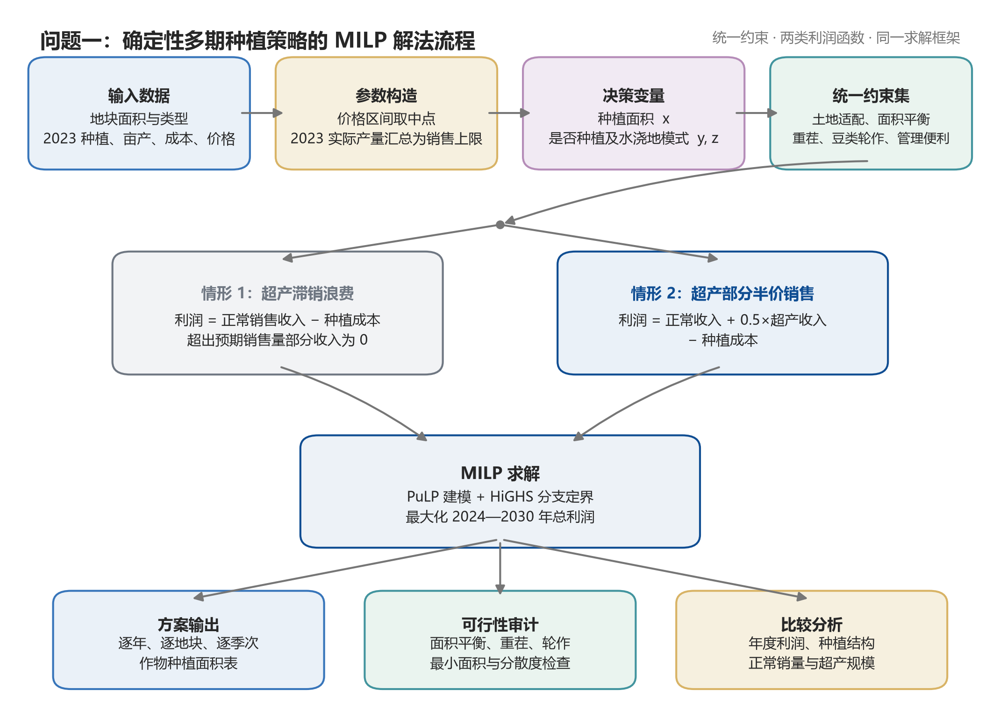

# 问题一 模型的建立

## 1 建模思路

问题一要求在销售量、亩产量、种植成本和销售价格保持不变的条件下，安排 2024—2030 年各地块的作物种植面积。决策既受土地类型和季次限制，又要满足禁止连续重茬、三年内安排豆类作物以及便于田间管理等要求。由于当前年度的种植会改变下一年度的可选方案，不能将七年规划拆成若干个彼此独立的单年度问题。

据此，以“地块—年份—季次—作物”为基本决策单元，将种植面积设为连续变量，将是否种植及水浇地种植模式设为 0-1 变量，建立确定性多期混合整数线性规划模型。两种滞销处理方式共用同一组农业约束，仅通过超产部分的销售折扣率改变利润函数。模型的总体流程如图所示。

## 2 模型假设与数据口径

为使附件数据能够直接用于七年规划，作如下约定。

1. 规划期内各作物的亩产量、单位面积种植成本和销售价格均保持 2023 年水平，不考虑通货膨胀、极端气候和临时扩建耕地等因素。
2. 附件给出的销售价格为区间时，以区间中点作为基准销售价格。智慧大棚第一季蔬菜沿用普通大棚第一季的亩产量、成本和价格，第二季采用附件中单列的智慧大棚参数。
3. 附件未单独给出各作物的预期销售量。以 2023 年实际种植面积乘相应亩产量，并按作物汇总所得的总产量作为年度预期销售量基准。
4. 2023 年种植记录作为 2024 年重茬约束和首个三年豆类轮作窗口的初始状态。
5. 题目中的“单块种植面积不宜太小”和“种植地不能太分散”属于定性要求。模型将其量化为：露天地块内单种作物的种植面积不低于 5 亩，大棚内不低于 0.3 亩；同一作物在同一年、同一季最多分布于 7 个地块。上述阈值属于管理参数，可在后续敏感性分析中调整。

## 3 符号说明

### 3.1 集合与下标

| 符号 | 含义 |
|---|---|
| $i\in I$ | 地块编号，包含露天地块和大棚 |
| $k\in K$ | 作物编号 |
| $t\in T=\{2024,\ldots,2030\}$ | 规划年份 |
| $s\in S=\{1,2\}$ | 种植季次；单季作物统一记入第一季 |
| $B\subseteq K$ | 豆类作物集合，包括粮食豆类和蔬菜豆类 |
| $K_{is}\subseteq K$ | 地块 $i$ 在季次 $s$ 允许种植的作物集合 |
| $\mathcal A$ | 所有满足土地类型和季次要求的可行四元组 $(i,t,s,k)$ 的集合 |
| $P_{kt}$ | 作物 $k$ 在年份 $t$ 可能出现的销售价格集合 |

为区分不同土地类型，进一步记平旱地、梯田和山坡地的集合为 $I_o$，水浇地集合为 $I_w$，普通大棚集合为 $I_g$，智慧大棚集合为 $I_h$。

### 3.2 参数

| 符号 | 含义 |
|---|---|
| $A_i$ | 地块 $i$ 的可用面积，单位为亩 |
| $a_{isk}$ | 作物 $k$ 在地块 $i$、季次 $s$ 的亩产量，单位为斤/亩 |
| $c_{isk}$ | 对应的单位面积种植成本，单位为元/亩 |
| $p_{isk}$ | 对应的销售价格，单位为元/斤 |
| $D_k$ | 作物 $k$ 的年度预期销售量，单位为斤 |
| $m_i$ | 地块 $i$ 上单种作物的最小种植面积 |
| $L$ | 同一作物每年每季允许分布的最大地块数，取 $L=7$ |
| $H_i^{2023}$ | 地块 $i$ 在 2023 年已经种植的豆类面积 |
| $r_{ik}^{2023,s}$ | 2023 年地块 $i$ 的季次 $s$ 是否种植作物 $k$ |
| $\delta$ | 超产部分的销售折扣率；滞销浪费时为 0，半价销售时为 0.5 |

其中，最小种植面积参数按地块类型取为

$$
m_i=
\begin{cases}
5, & i\in I_o\cup I_w,\\
0.3, & i\in I_g\cup I_h.
\end{cases}
$$

若某块露天地本身不足 5 亩，则以该地块的全部面积作为其最小种植面积，即实际使用 $\min\{5,A_i\}$。

### 3.3 决策变量

定义连续变量

$$
x_{itsk}\geq 0,
$$

表示年份 $t$ 的季次 $s$ 在地块 $i$ 上种植作物 $k$ 的面积。定义二元变量

$$
y_{itsk}=\begin{cases}
1, & x_{itsk}>0,\\
0, & x_{itsk}=0,
\end{cases}
$$

用于描述作物是否进入某地块，并连接最小种植面积和分散度约束。对水浇地另设模式变量

$$
z_{it}=\begin{cases}
1, & \text{水浇地 }i\text{ 在年份 }t\text{ 单季种植水稻},\\
0, & \text{水浇地 }i\text{ 在年份 }t\text{ 种植两季蔬菜}.
\end{cases}
$$

考虑到同一种作物在不同设施或季次下可能对应不同价格，按“作物—年份—价格”设置正常销量变量 $q_{ktp}\geq 0$。该变量表示作物 $k$ 在年份 $t$、价格为 $p$ 的产量中按正常价格销售的数量。

## 4 参数构造

### 4.1 销售价格

若附件中作物价格区间为 $[p_{isk}^{L},p_{isk}^{U}]$，则采用区间中点：

$$
p_{isk}=\frac{p_{isk}^{L}+p_{isk}^{U}}{2}.
$$

价格仍随作物、土地类型和季次而变化。这样既保留不同生产环境下的价格差异，又符合问题一“未来相对 2023 年保持稳定”的条件。

### 4.2 预期销售量

记 $x_{i,2023,s,k}^{(0)}$ 为附件给出的 2023 年实际种植面积，则作物 $k$ 的预期销售量取为

$$
D_k=\sum_{i\in I}\sum_{s\in S}a_{isk}x_{i,2023,s,k}^{(0)}.
$$

由于问题一假定未来销售条件稳定，$D_k$ 在 2024—2030 年各年保持不变。

### 4.3 作物适种集合

根据附件中的土地利用规则构造 $K_{is}$，只对 $(i,t,s,k)\in\mathcal A$ 创建决策变量，其余组合的种植面积视为 0。各类土地的可选作物如下。

| 地块类型 | 第一季或单季 | 第二季 |
|---|---|---|
| 平旱地、梯田、山坡地 | 除水稻外的粮食作物 | 不安排作物 |
| 水浇地 | 单季水稻，或第一季蔬菜 | 选择两季蔬菜模式时，只种大白菜、白萝卜或红萝卜 |
| 普通大棚 | 除大白菜、白萝卜和红萝卜外的蔬菜 | 食用菌 |
| 智慧大棚 | 除大白菜、白萝卜和红萝卜外的蔬菜 | 同类蔬菜 |

## 5 分段销售收益的线性化

### 5.1 分价格组产量

对于作物 $k$、年份 $t$ 和价格 $p\in P_{kt}$，定义该价格组的总产量

$$
Q_{ktp}=\sum_{(i,t,s,k)\in\mathcal A:\,p_{isk}=p}a_{isk}x_{itsk}.
$$

正常销量不能超过相应价格组的实际产量：

$$
0\leq q_{ktp}\leq Q_{ktp}.
$$

同一种作物在同一年内的正常销量还受到销售上限约束：

$$
\sum_{p\in P_{kt}}q_{ktp}\leq D_k,
\qquad \forall k\in K,\ t\in T.
$$

按价格分组后，模型可以在不引入非线性项的情况下，将有限的正常销售额度分配到不同价格批次。

### 5.2 两种情形的统一收入函数

在价格组 $(k,t,p)$ 中，$q_{ktp}$ 按正常价格销售，剩余产量 $Q_{ktp}-q_{ktp}$ 按折扣率 $\delta$ 销售。因此，总销售收入为

$$
R(\delta)=\sum_{t\in T}\sum_{k\in K}\sum_{p\in P_{kt}}
\left[pq_{ktp}+\delta p\left(Q_{ktp}-q_{ktp}\right)\right].
$$

将其整理为

$$
R(\delta)=\sum_{t\in T}\sum_{k\in K}\sum_{p\in P_{kt}}
\left[\delta pQ_{ktp}+(1-\delta)pq_{ktp}\right],
$$

可见目标仍是决策变量的线性函数。两种销售情形分别对应

$$
\delta=
\begin{cases}
0, & \text{超产部分滞销并浪费},\\
0.5, & \text{超产部分按正常价格的 }50\%\text{ 销售}.
\end{cases}
$$

总种植成本为

$$
C=\sum_{(i,t,s,k)\in\mathcal A}c_{isk}x_{itsk}.
$$

于是，两种情形可统一写成如下利润最大化模型：

$$
\max Z(\delta)=R(\delta)-C.
$$

## 6 约束条件

### 6.1 种植面积与指示变量联动

对任意可行组合 $(i,t,s,k)\in\mathcal A$，有

$$
m_i y_{itsk}\leq x_{itsk}\leq A_i y_{itsk}.
$$

该约束保证 $y_{itsk}=0$ 时种植面积为 0；一旦选择该作物，其面积不得低于管理要求给定的最小值。

### 6.2 地块面积平衡

对平旱地、梯田、山坡地以及普通大棚、智慧大棚的有效种植季次，要求地块面积得到完整配置：

$$
\sum_{k\in K_{is}}x_{itsk}=A_i.
$$

水浇地需要在单季水稻和两季蔬菜之间作出互斥选择。记水稻作物为 $k_r$，第一季普通蔬菜集合为 $K_v^{(1)}$，第二季三种限定蔬菜集合为 $K_v^{(2)}$，则

$$
x_{it1k_r}=A_i z_{it},
$$

$$
\sum_{k\in K_v^{(1)}}x_{it1k}=A_i(1-z_{it}),
$$

$$
\sum_{k\in K_v^{(2)}}x_{it2k}=A_i(1-z_{it}),
\qquad i\in I_w,\ t\in T.
$$

当 $z_{it}=1$ 时，该水浇地全部用于单季水稻；当 $z_{it}=0$ 时，两季分别按允许作物集合安排蔬菜。

### 6.3 连续重茬约束

对一年仅种一季的露天地，同一作物不得连续两年出现：

$$
y_{it1k}+y_{i,t+1,1,k}\leq 1,
\qquad i\in I_o,\ k\in K_{i1},\ t=2024,\ldots,2029.
$$

2023 年已经种植的作物还需限制其在 2024 年再次进入同一地块：

$$
y_{i,2024,1,k}\leq 1-r_{ik}^{2023,1}.
$$

水浇地的两种蔬菜集合在相邻季次中互不重合，蔬菜重茬由适种集合自动排除；水稻则需满足跨年约束

$$
y_{it1k_r}+y_{i,t+1,1,k_r}\leq 1,
\qquad i\in I_w.
$$

智慧大棚两季可种植相同的蔬菜集合，因此既要限制同一年相邻两季，也要限制本年第二季与下一年第一季：

$$
y_{it1k}+y_{it2k}\leq 1,
$$

$$
y_{it2k}+y_{i,t+1,1,k}\leq 1,
\qquad i\in I_h,\ k\in K_{i1}.
$$

首个规划季同样与 2023 年智慧大棚第二季的实际种植记录相衔接。

### 6.4 滚动三年豆类轮作约束

题目要求每块地的全部土地在三年内至少安排一次豆类作物。为允许同一地块分区种植，将其转化为“任意连续三年内累计豆类种植面积不少于该地块面积”的面积等价约束。

对于首个窗口 2023—2025，有

$$
H_i^{2023}+\sum_{t=2024}^{2025}\sum_{s\in S}
\sum_{k\in B\cap K_{is}}x_{itsk}\geq A_i.
$$

对于其余滚动窗口 $h=2024,\ldots,2028$，有

$$
\sum_{t=h}^{h+2}\sum_{s\in S}
\sum_{k\in B\cap K_{is}}x_{itsk}\geq A_i,
\qquad \forall i\in I.
$$

该写法允许豆类面积在三年间分批完成，同时保证一个窗口内的累计覆盖面积达到整块土地的一次轮作需求。

### 6.5 种植分散度约束

为避免同一种作物在多个零散地块上铺开，对每个作物、年份和季次限制其占用地块数：

$$
\sum_{i:(i,t,s,k)\in\mathcal A}y_{itsk}\leq L,
\qquad \forall k\in K,\ t\in T,\ s\in S.
$$

### 6.6 变量取值范围

$$
x_{itsk}\geq 0,\qquad q_{ktp}\geq 0,
$$

$$
y_{itsk}\in\{0,1\},\qquad z_{it}\in\{0,1\}.
$$

目标函数和全部约束均为线性形式，且模型同时包含连续变量和二元变量，因此属于混合整数线性规划模型。

## 7 模型求解流程

模型使用 PuLP 完成变量、目标函数和约束的程序化构造，并调用 HiGHS 求解器进行分支定界。对两种情形分别令 $\delta=0$ 和 $\delta=0.5$，其余参数与约束保持不变，以保证方案之间具有一致的比较基础。程序将相对最优间隙设为 1%，单个情形的求解时间上限设为 240 秒，并使用 4 个线程。

求解结束后，不直接将求解器返回状态视为方案有效性的唯一依据，而是重新检查地块面积平衡、最小种植面积、作物分散度、滚动三年豆类轮作和连续重茬约束。通过复核的种植面积再按年份写入题目给定的结果模板，并同步形成年度、作物和土地类型层面的汇总表，为后续模型求解与结果分析提供数据基础。

## 8 本节小结

上述模型以统一的多期 MILP 框架连接土地利用、轮作管理和市场销售约束。价格组销量变量将销售上限和超产折价处理转化为线性表达；水浇地模式变量刻画单季水稻与两季蔬菜之间的互斥关系；种植指示变量则承载最小面积、分散度和重茬约束。两种情形只改变超产折扣率，因此其种植策略差异可归因于销售处置规则，而不会受到约束口径变化的干扰。
