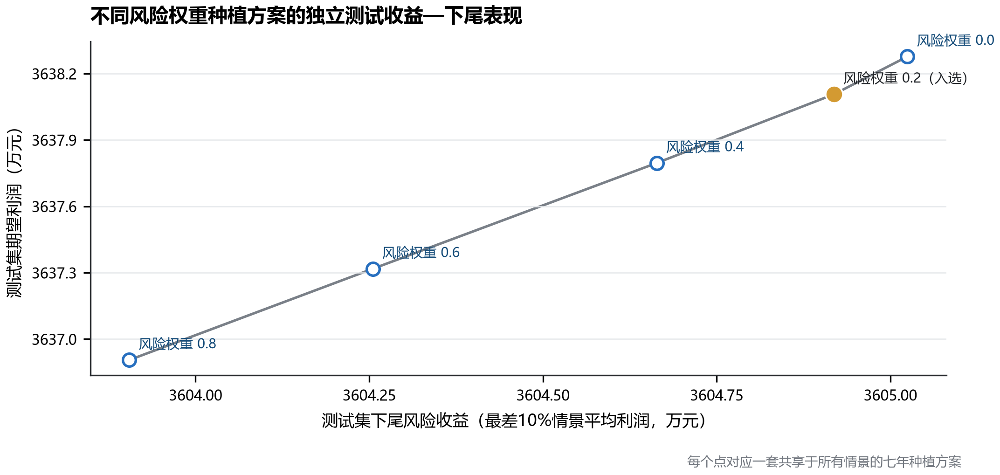
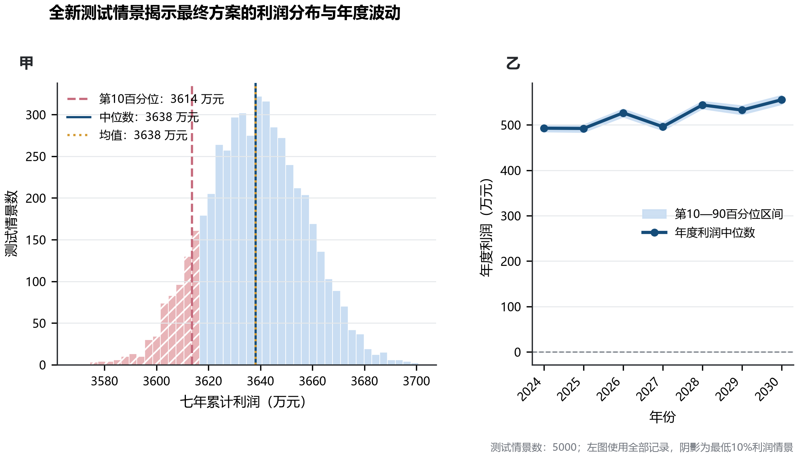
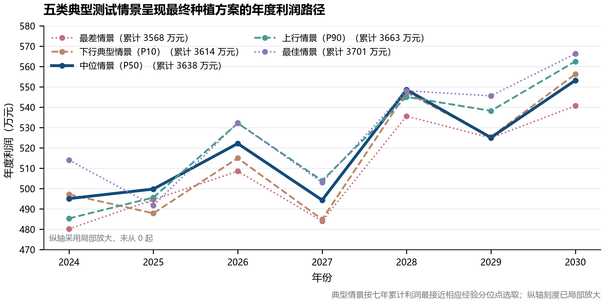
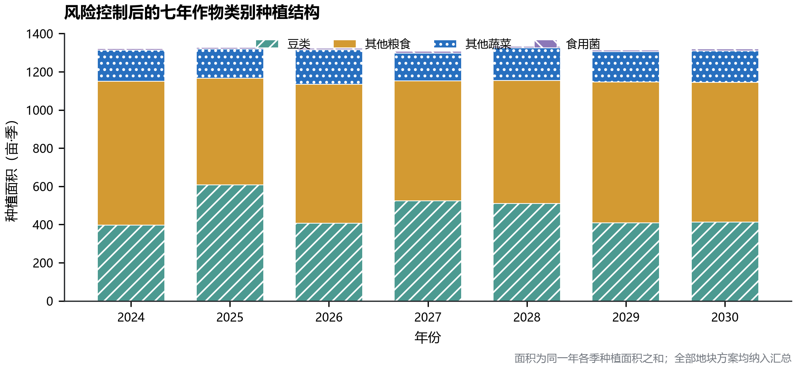
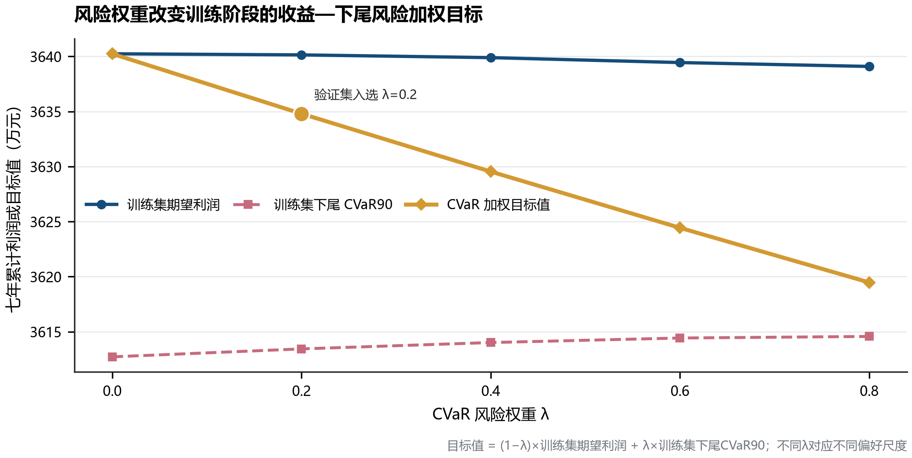
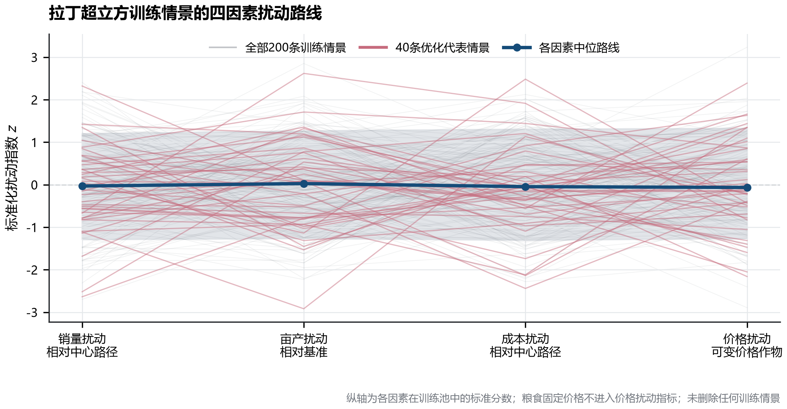

# 问题二 模型的求解

## 1 求解设置与结果输出

依据前述情景随机混合整数线性规划模型，先生成 200 条拉丁超立方七年路径，再按综合状态指标划分为 40 个等频层，并从每层选取一条代表路径进入优化。五个风险权重分别取

$$
\lambda\in\{0,0.2,0.4,0.6,0.8\}.
$$

每个权重均独立构建完整模型，未固定其他权重对应的作物支持集或种植面积。单个模型包含 31485 个变量、47635 条约束，其中二元变量 7490 个。程序使用 PuLP 调用 HiGHS 求解器，设置 75 s 时间上限、2%相对最优间隙目标和 4 个求解线程。

风险权重由 2000 条独立蒙特卡洛验证路径确定。权重选定后冻结种植方案，再使用 5000 条全新蒙特卡洛路径进行样本外测试。训练、验证和测试的随机种子分别为 202402、202403 和 202404。逐地块、逐季次、逐作物的 2024—2030 年种植面积已写入 `Q2/outputs/result2.xlsx`，完整风险指标、年度利润和种植结构保存在 `Q2/outputs/问题二_随机规划_CVaR分析结果_更新版.xlsx`。

## 2 候选模型求解与训练目标

五个模型均在规定时限内得到整数可行解，但 HiGHS 均因达到时间上限而停止，最终相对间隙为 15.18%—15.25%，高于预设的 2%目标。因此，本节报告的是当前计算预算下获得的可行候选方案，不能将其表述为已经证明的全局最优解。风险中性方案采用冷启动，其余模型使用风险中性方案作为 MIP 启动点；启动点只用于加速搜索，没有固定决策变量。

**表 1  不同风险权重的 MILP 求解结果**

| 风险权重 $\lambda$ | 求解时间/s | 最终相对间隙 | 相对 $\lambda=0$ 的面积变化单元数 | 总绝对面积差/亩 | 作物支持集变化单元数 | 求解状态 |
|---:|---:|---:|---:|---:|---:|---|
| 0.0 | 76.01 | 15.197% | 0 | 0.00 | 0 | 达到时限，获得整数可行解 |
| 0.2 | 78.87 | 15.179% | 70 | 385.85 | 0 | 达到时限，获得整数可行解 |
| 0.4 | 77.19 | 15.184% | 90 | 423.07 | 0 | 达到时限，获得整数可行解 |
| 0.6 | 76.30 | 15.209% | 92 | 435.93 | 0 | 达到时限，获得整数可行解 |
| 0.8 | 90.92 | 15.253% | 92 | 454.22 | 0 | 达到时限，获得整数可行解 |

方案差异检查表明，五个风险权重并未退化为完全相同的种植面积。随着 $\lambda$ 增大，相对风险中性方案发生变化的面积单元由 70 个增至 92 个，总绝对面积差由 385.85 亩增至 454.22 亩。不过，作物支持集变化单元数均为 0，说明模型主要在既有作物组合内部调整面积，而没有改变作物是否进入某一“地块—年份—季次”单元。该现象也解释了不同权重候选方案的利润指标为何十分接近。

40 条代表情景上的训练结果列于表 2。风险权重由 0 增至 0.8 时，训练期望利润由 3640.24 万元降至 3639.09 万元，下尾 CVaR90 由 3612.72 万元升至 3614.57 万元，呈现出模型设定所预期的平均收益—下尾保护权衡。各行的目标重算值与求解器目标值之间的误差均小于 $10^{-6}$ 元量级，可视为浮点运算误差。

**表 2  优化代表情景上的训练目标**

| $\lambda$ | 训练期望利润/万元 | 训练下尾 CVaR90/万元 | CVaR 加权目标/万元 |
|---:|---:|---:|---:|
| 0.0 | 3640.24 | 3612.72 | 3640.24 |
| 0.2 | 3640.14 | 3613.44 | 3634.80 |
| 0.4 | 3639.89 | 3614.02 | 3629.54 |
| 0.6 | 3639.45 | 3614.43 | 3624.44 |
| 0.8 | 3639.09 | 3614.57 | 3619.48 |

不过，在未参与优化的完整 200 条训练池上重新评价时，下尾 CVaR90 由 $\lambda=0$ 的 3606.17 万元降至 $\lambda=0.8$ 的 3605.08 万元。可见表 2 中的尾部改善依赖于 40 条代表情景，尚不能单凭训练目标判断风险控制在样本外仍然有效。

## 3 风险权重的验证集选择

五个候选方案在验证集上的平均利润均达到最高验证均值的 97%，因而全部进入第二阶段的 CVaR 比较。验证集下尾 CVaR90 的最高值出现在 $\lambda=0$，为 3605.56 万元；$\lambda=0.2$ 对应 3605.43 万元，两者仅相差 0.13 万元，相对差异约为 0.0037%，低于预先设定的 0.01%并列容差。近似并列集合因此包含 $\lambda=0$ 和 $\lambda=0.2$。按照“优先选择最接近中等风险权重 0.4 的候选方案”这一预设规则，最终取

$$
\lambda^{*}=0.2.
$$

**表 3  风险权重候选方案的独立验证与样本外测试结果**

| $\lambda$ | 验证期望利润/万元 | 验证下尾 CVaR90/万元 | 测试期望利润/万元 | 测试下尾 CVaR90/万元 | 测试标准差/万元 | 是否入选 |
|---:|---:|---:|---:|---:|---:|---|
| 0.0 | 3638.29 | 3605.56 | 3638.28 | 3605.02 | 19.10 | 否 |
| **0.2** | **3638.12** | **3605.43** | **3638.11** | **3604.92** | **19.05** | **是** |
| 0.4 | 3637.82 | 3605.14 | 3637.80 | 3604.66 | 19.02 | 否 |
| 0.6 | 3637.37 | 3604.67 | 3637.32 | 3604.26 | 18.99 | 否 |
| 0.8 | 3636.97 | 3604.29 | 3636.91 | 3603.90 | 18.96 | 否 |

这里的入选结果需要结合并列规则理解。$\lambda=0.2$ 并没有在验证集或测试集上取得严格更高的下尾 CVaR；与风险中性方案相比，它在测试集上的期望利润低 0.17 万元，下尾 CVaR90 低 0.11 万元，但利润标准差低 0.04 万元。五个候选方案的测试期望利润最大差值仅为 1.37 万元，测试 CVaR 最大差值为 1.12 万元，均不足各自水平的 0.04%。当前分布假设、农业约束和求解精度下的样本外风险—收益前沿较为平坦，尚不能认为提高风险权重带来了稳定的尾部利润改善。

**图 1  不同风险权重候选方案的样本外风险—收益前沿。** 横轴为 5000 条测试路径中最差 10%利润的平均值，纵轴为测试期望利润。风险中性点位于右上方，入选的 $\lambda=0.2$ 与其非常接近；其余点随权重增加向左下移动，训练代表情景中的 CVaR 改善没有延续到独立测试集。

## 4 最终方案的样本外利润表现

固定 $\lambda=0.2$ 的种植方案后，在 5000 条全新路径上得到七年累计利润分布。测试期望利润为 3638.11 万元，中位数为 3638.21 万元，两者接近，利润分布没有出现明显的中心偏移。P10 和 P90 分别为 3613.65 万元与 3662.71 万元，利润标准差为 19.05 万元；最差 10%测试情景的平均利润，即下尾 CVaR90，为 3604.92 万元。全部测试路径的七年累计利润均为正，累计亏损概率为 0；平均滞销率为 27.49%。

**表 4  最终方案的 5000 条测试路径汇总指标**

| 指标 | 数值 |
|---|---:|
| 测试情景数 | 5000 |
| 七年期望利润/万元 | 3638.11 |
| 利润标准差/万元 | 19.05 |
| P10 利润/万元 | 3613.65 |
| P50 利润/万元 | 3638.21 |
| P90 利润/万元 | 3662.71 |
| 下尾 CVaR90/万元 | 3604.92 |
| 累计亏损概率 | 0.00% |
| 平均滞销率 | 27.49% |

年度利润并非单调增加。2024—2025 年均值约为 492 万元，2026 年升至 526.31 万元，2027 年回落至 496.00 万元，此后在 2028—2030 年保持在 532.53—555.08 万元。2030 年的平均利润最高，2025 年最低。各年度 5000 条测试路径中均未出现负利润。

**表 5  最终方案的年度样本外利润区间**

| 年份 | P10/万元 | 平均利润/万元 | P50/万元 | P90/万元 | 年度亏损概率 |
|---:|---:|---:|---:|---:|---:|
| 2024 | 485.55 | 492.51 | 492.55 | 499.29 | 0.00% |
| 2025 | 484.35 | 491.98 | 492.01 | 499.34 | 0.00% |
| 2026 | 518.14 | 526.31 | 526.36 | 534.49 | 0.00% |
| 2027 | 488.24 | 496.00 | 495.86 | 504.01 | 0.00% |
| 2028 | 536.15 | 543.71 | 543.70 | 551.33 | 0.00% |
| 2029 | 523.41 | 532.53 | 532.53 | 541.56 | 0.00% |
| 2030 | 545.69 | 555.08 | 555.19 | 564.40 | 0.00% |

**图 2  最终方案的测试利润分布与年度波动。** 左图使用全部 5000 条测试记录，均值与中位数几乎重合，阴影标出最低 10%利润情景；右图给出年度 P10—P90 区间和中位数。图中区间来自设定分布下的模拟结果，不等同于根据多年历史观测估计的统计置信区间。

## 5 典型测试情景分析

为展示累计利润相近时年度路径仍可能存在的差异，从测试集中选取最差、P10、P50、P90 和最佳五类典型情景。典型路径只承担结果展示功能，没有参与风险权重选择或模型求解。

**表 6  五类典型测试情景的七年累计利润**

| 典型情景 | 测试情景编号 | 经验分位位置 | 七年累计利润/万元 |
|---|---:|---:|---:|
| 最差情景 | 1110 | 最小值 | 3568.43 |
| 下行典型情景 | 4408 | P10 | 3613.65 |
| 中位情景 | 735 | P50 | 3638.21 |
| 上行典型情景 | 1256 | P90 | 3662.71 |
| 最佳情景 | 457 | 最大值 | 3700.94 |

五条路径均表现出较明显的年度起伏：2026 年相对 2025 年普遍上升，2027 年回落，2028 年再次增加，2030 年达到各自路径中的较高水平。最差情景的七年累计利润仍为正，但其年度利润并非在每一年都低于其他典型情景。例如最差情景的 2025 年利润高于 P10 情景，说明“最差”是按七年累计利润定义，而不是逐年同时取最小值。

**图 3  五类典型测试情景的年度利润路径。** 曲线间差异经过局部纵轴放大后可见，纵轴未从 0 开始。该图用于比较年度路径形态，不能据曲线视觉间距直接判断相对增幅。

## 6 最终种植方案及作物结构

入选方案的七年累计种植面积为 9248.00 亩·季，其中其他粮食为 4781.85 亩·季，占 51.71%；豆类为 3264.70 亩·季，占 35.30%；其他蔬菜为 1134.25 亩·季，占 12.26%；食用菌为 67.20 亩·季，占 0.73%。这里的“亩·季”按各季种植面积累加，并不表示耕地的物理面积发生变化。

**表 7  最终方案的年度作物类别结构**

| 年份 | 豆类/亩·季 | 其他粮食/亩·季 | 其他蔬菜/亩·季 | 食用菌/亩·季 | 合计/亩·季 |
|---:|---:|---:|---:|---:|---:|
| 2024 | 396.88 | 753.32 | 162.20 | 9.60 | 1322.00 |
| 2025 | 607.00 | 559.30 | 152.10 | 9.60 | 1328.00 |
| 2026 | 405.80 | 728.00 | 180.60 | 9.60 | 1324.00 |
| 2027 | 524.20 | 628.10 | 145.10 | 9.60 | 1307.00 |
| 2028 | 509.96 | 644.14 | 170.30 | 9.60 | 1334.00 |
| 2029 | 407.75 | 738.00 | 158.65 | 9.60 | 1314.00 |
| 2030 | 413.11 | 730.99 | 165.30 | 9.60 | 1319.00 |
| **七年合计** | **3264.70** | **4781.85** | **1134.25** | **67.20** | **9248.00** |

豆类面积在 2025 年达到 607.00 亩·季，2027—2028 年仍保持在 500 亩·季以上，与滚动三年豆类轮作约束相衔接；相应年份的其他粮食面积有所下降。七年累计面积较大的具体作物包括小麦 1531.26 亩·季、黄豆 1024.41 亩·季、玉米 996.25 亩·季、谷子 907.00 亩·季和绿豆 689.37 亩·季。小麦、玉米保持较高配置，与题目设定的销量增长路径一致；黄豆、绿豆等豆类则同时承担收益配置和轮作任务。

各年累计种植面积为 1307—1334 亩·季。年度总量变化来自水浇地在单季水稻与两季蔬菜之间切换，而不是可用耕地面积改变。食用菌面积稳定为每年 9.60 亩·季，对应普通大棚第二季的固定土地利用结构。

**图 4  风险控制后的年度作物类别结构。** 其他粮食和豆类构成种植面积主体，两类面积随轮作安排在年份间交替变化；蔬菜面积波动较小，食用菌保持稳定。逐地块、逐季次的完整安排以 `Q2/outputs/result2.xlsx` 为准。

## 7 可行性、稳健性与结果边界

写入结果模板前，程序对入选方案进行了逐项复核。面积平衡最大误差为 0，最小种植面积、种植分散度、滚动三年豆类轮作和连续重茬约束的违规数均为 0。由此确认，最终种植面积满足模型采用的全部硬约束。

**表 8  最终方案的硬约束复核结果**

| 检查项 | 复核结果 |
|---|---:|
| 面积平衡最大误差/亩 | 0 |
| 最小种植面积违规数 | 0 |
| 分散度约束违规数 | 0 |
| 豆类轮作约束违规数 | 0 |
| 连续重茬约束违规数 | 0 |

训练目标的变化见图 5。期望利润随风险权重缓慢下降，代表情景上的下尾 CVaR90 小幅上升，说明面积调整响应了训练目标中的风险偏好。不同 $\lambda$ 下的加权目标采用不同评价尺度，其数值差额不能直接解释为实际利润损失。

**图 5  风险权重与训练阶段收益—风险目标。** 三条曲线分别对应训练期望利润、训练下尾 CVaR90 和按各自风险权重计算的加权目标。图中高亮点为验证集选出的 $\lambda=0.2$ 候选方案。

情景削减的覆盖情况见图 6。灰线表示全部 200 条训练路径，红线为 40 条优化代表路径，蓝线给出各扰动因素的中位路线。代表路径覆盖了销量、亩产量、成本和可变价格的主要标准化区间，并保留了两端情景；纵轴为标准分数，不能直接解释为原始百分比。

**图 6  拉丁超立方训练情景及优化代表路径。** 图中保留全部训练路径，并突出用于优化的代表路径。粮食价格固定，不进入价格扰动的标准化统计。

样本外评价避免了使用优化情景自我验证，但仍有两项边界需要保留。其一，5000 条测试路径来自题面区间及本文设定的概率分布，并非真实历史数据，因而 0 的模拟亏损概率不能解释为现实经营中绝不会亏损。其二，五个模型的最终相对间隙均约为 15%，候选方案还可能随更长求解时间而改进。尤其是训练代表情景上的 CVaR 增益没有在验证集和测试集中复现，这可能同时受到情景削减误差、有限训练样本和 MILP 未充分收敛的影响。当前结果支持将 $\lambda=0.2$ 视为预设验证规则下选出的可行折中方案，不支持把它解释为对风险中性方案的严格支配。

## 8 问题二结论

在题目给定的波动区间和本文采用的独立分布假设下，验证流程选取了风险权重 $\lambda=0.2$ 的种植方案。该方案在 5000 条独立测试路径上的七年期望利润为 3638.11 万元，下尾 CVaR90 为 3604.92 万元，P10—P90 区间为 3613.65—3662.71 万元，累计模拟亏损概率为 0，平均滞销率为 27.49%。详细种植面积已写入 `Q2/outputs/result2.xlsx`。

候选方案之间的样本外差异很小，且风险中性方案在测试期望利润和下尾 CVaR 上均略高于入选方案。$\lambda=0.2$ 的采用源于预先声明的 0.01% 数值并列规则，并不代表观察到了额外的样本外尾部改善。考虑到求解时限下仍有约 15% 的相对间隙，本文将提交方案表述为当前计算预算和验证规则下得到的整数可行方案；若计算资源允许，可延长求解时间或增加代表情景数量，检验种植面积及风险前沿是否进一步稳定。
