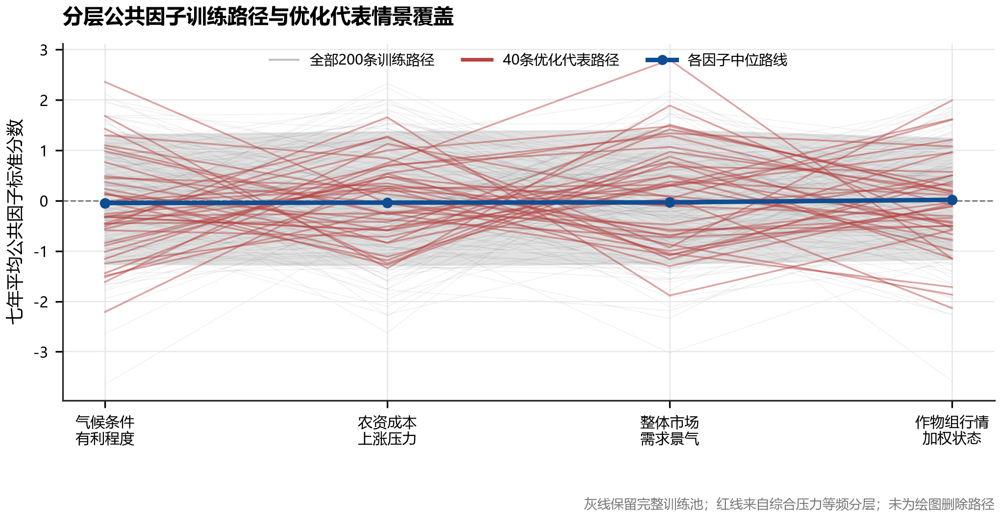
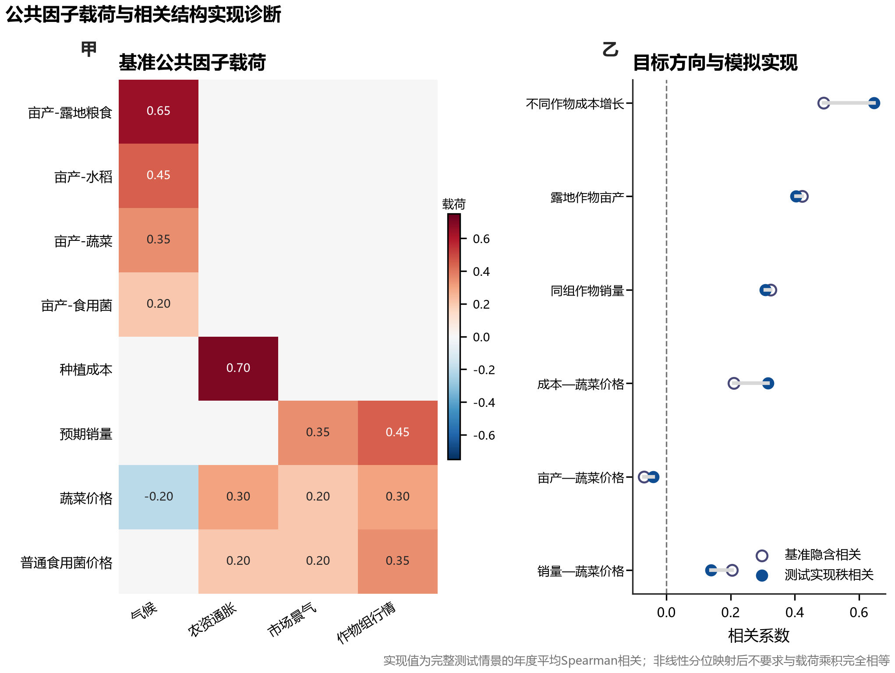
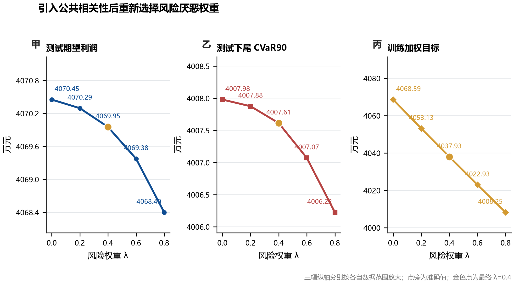
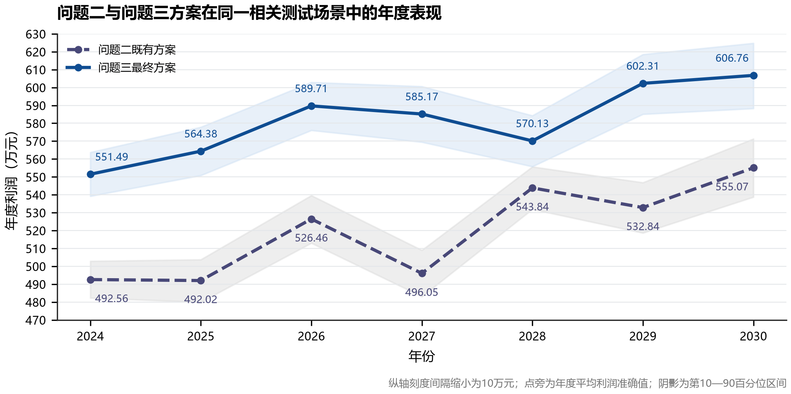
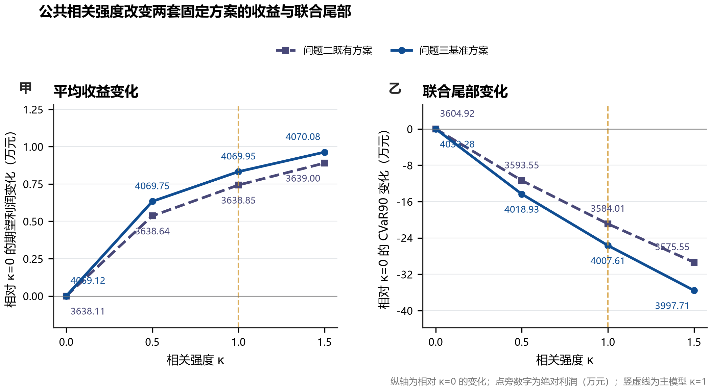
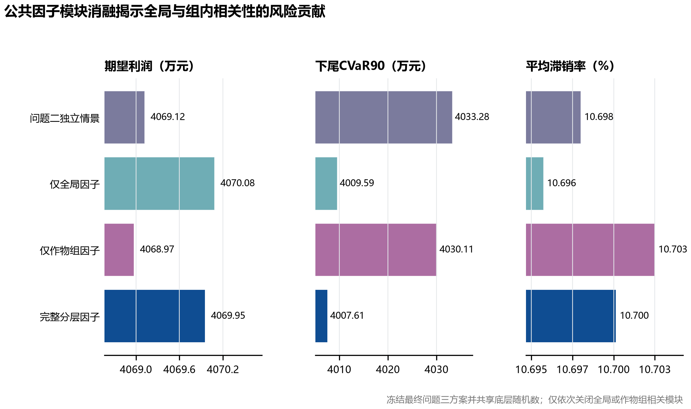

# 问题三 模型的求解

## 1 求解流程与数值口径

问题三在问题二随机混合整数规划的基础上，用分层公共因子 Gaussian Copula 生成相关情景。正式运行采用 200 条拉丁超立方训练路径，并经综合压力等频分层缩减为 40 条代表路径；风险权重选择和最终评价分别使用 2000 条验证路径与 5000 条测试路径。三类样本的随机种子相互独立，问题二既有方案与问题三方案则在同一批相关测试路径上配对评价。

本文统一以万元报告利润。求解器原始输出仍以元保存于分析工作簿，表中数值由原始结果除以 $10^4$ 后得到。风险指标采用七年累计利润口径，下尾 $\mathrm{CVaR}_{0.90}^{-}$ 表示利润最低 10% 情景的平均值。（详细地块—年份—季次—作物安排已写入“Q3/outputs/result3.xlsx”，本节只保留能够说明方案结构和风险表现的汇总结果。）

五个风险权重对应的 MILP 规模相同，均含 31485 个变量、47635 条约束和 7490 个二元变量。HiGHS 在给定时限内均返回整数可行解，但状态为“达到时间上限”，MIP 相对间隙介于 2.96% 与 3.23% 之间。因此，下文把输出称为“最终采用方案”或“整数可行方案”，不宣称其已被证明为全局最优。

## 2 相关情景的有效性检查

### 2.1 公共因子路径与情景削减

完整训练池包含 200 条七年公共因子路径，40 条优化代表路径由综合压力等频分层选出。图 2 中灰线给出全部训练路径，红线为代表路径，蓝线为各因子的中位路线。代表路径在气候、农资通胀、整体市场和作物组行情四个维度上均覆盖了正、负扰动区域，没有只保留接近均值的温和情景。四条中位路线均靠近 0，也与标准化公共因子的中心位置一致。

这一结果说明情景削减保留了训练池的主要压力层次。代表情景仍是原始路径，而非各维度均值拼接而成的虚拟情景，故其销量、亩产、成本和价格组合能够直接进入后续随机 MILP。

### 2.2 边际分布保持

引入 Copula 的目的在于改变联合分位结构，而不是改变问题二设定的单变量波动范围。独立情景和相关情景的边际统计见表 1。

表 1  独立情景与相关情景的边际统计对比

| 随机变量 | 独立情景均值 | 相关情景均值 | 独立情景 P10—P90 | 相关情景 P10—P90 |
|---|---:|---:|---:|---:|
| 销量相对 2023 年基准 | 1.01708 | 1.01716 | 0.96052—1.04462 | 0.96057—1.04464 |
| 亩产乘数 | 1.00005 | 1.00028 | 0.91999—1.08007 | 0.92022—1.08018 |
| 累计成本乘数 | 1.22135 | 1.22111 | 1.05449—1.39329 | 1.05444—1.39242 |
| 可变价格乘数 | 1.17945 | 1.17936 | 0.94628—1.38601 | 0.94707—1.38520 |

四类变量的均值和 P10—P90 区间均基本重合。销量相对基准值的均值差为 $7.56\times10^{-5}$，亩产、成本和可变价格的均值差也均低于 $2.5\times10^{-4}$。因此，问题二与问题三的差异可以主要归因于相关结构和由此产生的种植决策调整，而不是边际分布被意外改写。

### 2.3 相关方向的实现

表 2 对比了基准载荷隐含的相关量级与 5000 条测试路径中的 Spearman 秩相关。六类关系的符号全部一致。

表 2  公共因子相关结构实现结果

| 相关关系 | 基准隐含相关 | 实现 Spearman 相关 | 绝对偏差 | 符号一致 |
|---|---:|---:|---:|---|
| 不同作物成本增长 | 0.490 | 0.646 | 0.156 | 是 |
| 露地作物亩产 | 0.423 | 0.404 | 0.018 | 是 |
| 同组作物销量 | 0.325 | 0.308 | 0.017 | 是 |
| 成本—蔬菜价格 | 0.210 | 0.317 | 0.107 | 是 |
| 亩产—蔬菜价格 | -0.070 | -0.041 | 0.029 | 是 |
| 销量—蔬菜价格 | 0.205 | 0.140 | 0.065 | 是 |

露地亩产和同组销量的实现值与基准量级较接近。跨作物成本增长、成本—蔬菜价格的实现相关高于载荷乘积，而蔬菜亩产—价格仍保持负向。出现数值偏差的原因在于潜在正态变量还要经过非线性分位映射和年度复合，载荷乘积并不等同于最终变量的 Spearman 相关。因而这里关注方向和数量级，不把载荷解释为由 2023 年数据估计得到的经验相关系数。

图 5 的左侧面板列出固定载荷，右侧面板连接基准隐含相关与测试实现相关。所有连线均位于相同符号一侧，说明气候、通胀和市场因子的传导方向在模拟数据中得到了保留。

## 3 风险权重选择与求解状态

### 3.1 候选方案比较

按照“验证集期望利润至少保留最高值的 97%，再比较下尾 CVaR”的规则，对 $\lambda\in\{0,0.2,0.4,0.6,0.8\}$ 分别求解完整 MILP。候选方案结果见表 3。

表 3  不同风险权重下的验证与测试结果

| $\lambda$ | 验证期望利润/万元 | 验证下尾 CVaR/万元 | 测试期望利润/万元 | 测试下尾 CVaR/万元 | MIP 间隙/% | 是否采用 |
|---:|---:|---:|---:|---:|---:|---|
| 0.0 | 4069.32 | 4007.37 | 4070.45 | 4007.98 | 2.96 | 否 |
| 0.2 | 4069.16 | 4007.31 | 4070.29 | 4007.88 | 3.00 | 否 |
| 0.4 | 4068.81 | 4007.08 | 4069.95 | 4007.61 | 3.06 | 是 |
| 0.6 | 4068.23 | 4006.52 | 4069.38 | 4007.07 | 3.14 | 否 |
| 0.8 | 4067.28 | 4005.78 | 4068.40 | 4006.22 | 3.23 | 否 |

五个候选在验证集上的期望利润均高于最高均值的 97%，因而全部进入 CVaR 比较。$\lambda=0$、$0.2$ 和 $0.4$ 的验证下尾 CVaR 与最高值之差均落入预设的 0.01% 数值容差；按平局规则，选取最接近中等风险水平的 $\lambda=0.4$。该权重由验证集确定，测试集没有参与参数选择。

测试结果随 $\lambda$ 增大略有下降，但五套方案之间的差异很小：测试期望利润从 4070.45 万元降至 4068.40 万元，下尾 CVaR 从 4007.98 万元降至 4006.22 万元。结合约 3% 的 MIP 间隙，这些万元量级的差异不足以支持候选方案之间的严格优劣判断。$\lambda=0.4$ 的采用主要来自预先声明的验证集平局规则，而非事后挑选测试集最高值。

图 3 分别展示测试期望利润、测试下尾 CVaR 和训练加权目标。前两项随风险权重缓慢变化，训练加权目标则因目标中 CVaR 权重增加而下降。金色点标出最终采用的 $\lambda=0.4$，其含义是验证阶段的解释性平局选择，并不表示曲线在该点取得数值峰值。

### 3.2 最终方案的样本外风险指标

冻结 $\lambda=0.4$ 对应的种植方案后，在 5000 条全新相关测试路径上得到表 4。

表 4  问题三最终方案的样本外指标

| 指标 | 数值 |
|---|---:|
| 七年期望利润 | 4069.95 万元 |
| 利润标准差 | 36.26 万元 |
| P10 利润 | 4023.92 万元 |
| P50 利润 | 4069.83 万元 |
| P90 利润 | 4116.81 万元 |
| 下尾 $\mathrm{CVaR}_{0.90}^{-}$ | 4007.61 万元 |
| 累计亏损概率 | 0.00% |
| 平均滞销率 | 10.70% |

P10、P50 和期望利润较为接近，P90 与 P10 的差为 92.89 万元。测试集中未出现七年累计亏损，但这只适用于设定的波动区间和相关结构，不能外推为实际经营中不存在亏损风险。

## 4 最终种植结构

完整方案含 744 条非零“地块—年份—季次—作物”记录。为便于观察跨期调整，将作物汇总为其他粮食、豆类、其他蔬菜和食用菌四类，结果见表 5。表中的面积为各季种植面积之和；由于水浇地和大棚可以安排两季作物，年度累计种植面积可以超过 1201 亩的物理耕地面积。

表 5  2024—2030 年作物大类种植结构

| 年份 | 其他粮食/亩 | 豆类/亩 | 其他蔬菜/亩 | 食用菌/亩 | 年度累计面积/亩 |
|---:|---:|---:|---:|---:|---:|
| 2024 | 684.58 | 473.83 | 143.99 | 9.60 | 1312.00 |
| 2025 | 733.59 | 425.60 | 155.21 | 9.60 | 1324.00 |
| 2026 | 767.00 | 385.80 | 137.60 | 9.60 | 1300.00 |
| 2027 | 709.76 | 449.70 | 142.93 | 9.60 | 1312.00 |
| 2028 | 696.49 | 472.22 | 145.70 | 9.60 | 1324.00 |
| 2029 | 761.00 | 392.50 | 142.90 | 9.60 | 1306.00 |
| 2030 | 779.32 | 380.48 | 122.60 | 9.60 | 1292.00 |

其他粮食是各年的主体，面积占比由 2024 年的 52.18% 上升到 2030 年的 60.32%。豆类面积受滚动三年轮作约束影响，在 2024、2027 和 2028 年出现阶段性抬升，随后回落；其年度占比仍保持在 29.45%—36.11% 之间。其他蔬菜约占 9.49%—11.72%，食用菌固定为 9.60 亩。该结构同时满足粮食收益、豆类轮作和设施地适种要求，具体到每个地块的作物与面积以“result3.xlsx”为准。

## 5 与问题二方案的同场景比较

### 5.1 七年累计指标

问题二既有方案和问题三最终方案均在 $\kappa=1$ 的同一批 5000 条相关测试路径中评价。表 6 给出两套方案的主要指标。

表 6  问题二与问题三方案的配对测试结果

| 指标 | 问题二既有方案 | 问题三最终方案 | Q3-Q2 |
|---|---:|---:|---:|
| 期望利润/万元 | 3638.85 | 4069.95 | 431.10 |
| 利润标准差/万元 | 31.87 | 36.26 | 4.39 |
| P10 利润/万元 | 3598.27 | 4023.92 | 425.65 |
| P50 利润/万元 | 3638.72 | 4069.83 | 431.11 |
| P90 利润/万元 | 3679.91 | 4116.81 | 436.90 |
| 下尾 CVaR/万元 | 3584.01 | 4007.61 | 423.61 |
| 累计亏损概率 | 0.00% | 0.00% | 0.00 个百分点 |
| 平均滞销率 | 27.50% | 10.70% | -16.80 个百分点 |

问题三方案的期望利润比问题二方案高 431.10 万元，增幅为 11.85%；下尾 CVaR 高 423.61 万元，增幅为 11.82%。平均滞销率下降 16.80 个百分点，相对降幅为 61.09%。利润标准差增加 4.39 万元，说明收益水平提高的同时，绝对波动并未同步降低；风险改善主要体现在利润分布整体上移和滞销减少，而不是方差压缩。

对 5000 个情景编号进行 800 次配对 Bootstrap 后，期望利润差的 95% 经验区间为 430.76—431.42 万元，下尾 CVaR 差的区间为 422.50—424.51 万元，均未覆盖 0。该检验支持“在当前相关测试分布下，问题三方案的配对评价值较高”的结论，但不能消除整数规划尚有 MIP 间隙这一限制。

### 5.2 年度利润路径

表 7 分解了七年期望利润差。问题三方案在每个年份的平均利润均高于问题二方案，其中 2027 年差值最大，2028 年差值最小。

表 7  两套方案的年度平均利润

| 年份 | 问题二/万元 | 问题三/万元 | 差值/万元 |
|---:|---:|---:|---:|
| 2024 | 492.56 | 551.49 | 58.93 |
| 2025 | 492.02 | 564.38 | 72.36 |
| 2026 | 526.46 | 589.71 | 63.25 |
| 2027 | 496.05 | 585.17 | 89.12 |
| 2028 | 543.84 | 570.13 | 26.29 |
| 2029 | 532.84 | 602.31 | 69.47 |
| 2030 | 555.07 | 606.76 | 51.69 |

图 6 中实线与虚线分别对应问题三和问题二方案，阴影表示各自的 P10—P90 区间。两条曲线在七个年份均保持分离，说明累计利润差不是由某一个年份的异常值单独造成。2027 年问题二方案的平均利润处于其七年低位，而问题三方案维持在 585.17 万元，形成了最大的年度差距。

## 6 相关强度敏感性

固定两套方案，只改变公共载荷强度 $\kappa$，得到表 8。

表 8  不同相关强度下的同场景评价

| $\kappa$ | Q2 期望利润/万元 | Q2 下尾 CVaR/万元 | Q3 期望利润/万元 | Q3 下尾 CVaR/万元 |
|---:|---:|---:|---:|---:|
| 0.0 | 3638.11 | 3604.92 | 4069.12 | 4033.28 |
| 0.5 | 3638.64 | 3593.55 | 4069.75 | 4018.93 |
| 1.0 | 3638.85 | 3584.01 | 4069.95 | 4007.61 |
| 1.5 | 3639.00 | 3575.55 | 4070.08 | 3997.71 |

相关强度从 0 提高到 1.5 时，两套方案的期望利润仅分别增加 0.89 万元和 0.96 万元，变化不足 0.03%；下尾 CVaR 则分别下降 29.37 万元和 35.57 万元。同期，问题二方案的利润标准差由 19.05 万元增至 36.79 万元，问题三方案由 20.51 万元增至 42.18 万元。由此可见，公共相关性主要改变联合尾部和分布宽度，对均值影响很小。若只比较期望利润，相关风险会被掩盖。

图 1 以 $\kappa=0$ 为基准绘制变化量。左图的期望利润曲线近乎水平，右图的下尾 CVaR 随 $\kappa$ 单调下降，且问题三方案的下降幅度略大。图中同时标注绝对利润，避免因纵轴局部放大而误读经济量级。

## 7 公共因子消融

为区分全局冲击和组内行情的作用，冻结问题三最终方案，并在相同基础随机数下依次关闭公共因子模块。结果见表 9。

表 9  公共因子模块消融结果

| 情景模式 | 期望利润/万元 | 利润标准差/万元 | 下尾 CVaR/万元 | 平均滞销率/% |
|---|---:|---:|---:|---:|
| 独立情景 | 4069.12 | 20.51 | 4033.28 | 10.698 |
| 仅全局因子 | 4070.08 | 34.95 | 4009.59 | 10.696 |
| 仅作物组因子 | 4068.97 | 22.34 | 4030.11 | 10.703 |
| 完整分层因子 | 4069.95 | 36.26 | 4007.61 | 10.700 |

四种模式的期望利润极差仅为 1.11 万元，平均滞销率的极差不足 0.01 个百分点，但尾部指标差异明显。仅保留全局因子时，下尾 CVaR 比独立情景低 23.69 万元；仅保留作物组因子时低 3.17 万元；完整分层结构下低 25.67 万元。全局气候、农资通胀和整体市场因子是尾部风险扩大的主要来源，作物组因子提供了较小但同向的补充。完整模型的变化不是两个单模块结果的简单相加，因为分位映射、年度复合和销量截断共同作用于利润。

图 4 并列显示期望利润、下尾 CVaR 和平均滞销率。均值和滞销率在四种模式下基本稳定，而含全局因子的两种情景具有更低的下尾 CVaR，这与敏感性分析中“相关性主要改变联合尾部”的结论一致。

## 8 可行性复核与结论边界

最终方案的面积平衡最大误差为 0 亩；最小种植面积、作物分散度、滚动三年豆类轮作和连续重茬的违规数均为 0。由此，写入“result3.xlsx”的种植面积满足模型设定的全部农业硬约束。

综合而言，分层公共因子没有实质改变销量、亩产、成本和价格的边际分布，却使跨作物、跨变量冲击在同一情景中共同出现。采用 $\lambda=0.4$ 的最终整数可行方案在基准相关测试集上取得 4069.95 万元期望利润和 4007.61 万元下尾 CVaR，平均滞销率为 10.70%；相对问题二既有方案，配对期望利润和下尾 CVaR 分别提高 431.10 万元和 423.61 万元。敏感性与消融结果进一步表明，相关强度提高主要扩大分布宽度并压低联合尾部，全局公共因子承担了主要风险贡献。

上述结论限于题设边际区间、机理先验载荷和当前样本外模拟分布。所有候选 MILP 均在时限处停止，最终方案是通过硬约束复核的整数可行解，而不是已经证明的全局最优解；公共因子载荷也不能解释为从单年数据识别出的因果关系。
